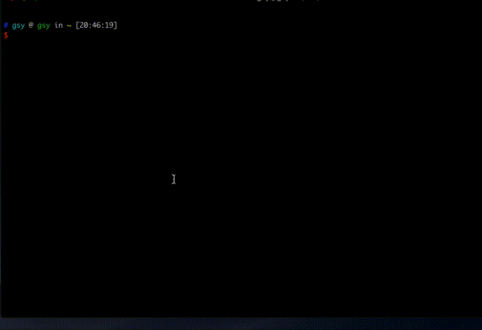

<p align="right" ><a href="./README.md">English</a>|<a href="./README-ZH.md">中文</a></p>

# 为什么要做gmr
- 现在我们CI构建过程太慢了(每次构建至少需要10分钟), 并且我们需要等待CI构建成功才能把代码合并到master分支。**如果现在有3个MR的话，至少需要30分钟才能把这三个MR合并到master分支**
- 每一个CI构建都是为了保证代码**没有编译错误**，然后构建一个apk存放在gitlab上
- 我们可以使用`dartanalyzer`代替CI来确保我们代码没有编译错误，因此**不用等待CI**便可以合并到master中
- 我们使用`gmr`，在dartanalyzer成功后，创建可以直接合并到master的MR

# 如何安装gmr
1. 安装gmr
   - 需要先安装wget，`brew install wget`
   - 需要先安装jq，`brew install jq`
```bash
wget https://github.com/gsy13213009/shell/archive/v1.0.0.tar.gz \
&& tar -zxvf v1.0.0.tar.gz \
&& rm v1.0.0.tar.gz \
&& cp shell-1.0.0/gmr /usr/local/bin \
&& rm -rf shell-1.0.0
```
2. 设置gitlab的token
   - 可以在gitlab上获取token：Settings>Access Token>Add a personal access token
   - `gmr --set-token="your token"`
3. 设置项目id(默认是341)
   - 可以在gitlab上项目的主页面查看项目id
   - `gmr --set-pid=111`
4. 设置用户id（创建的MR会分配给该用户），一般是自己的id
   - 可以在gitlab上获取用户id：Settings>Profile>Main settings
   - `gmr --set-uid=111`
5. 设置 dartanalyzer 路径
   - 可以在flutter的安装路径里获得
   - `gmr --set-dartanalyzer=/Users/gsy/flutter/bin/cache/dart-sdk/bin/dartanalyzer`
6. 安装示意图
   
  
# 现在可以使用gmr创建MR了
- 只执行`gmr`的话，需要在dartanalyzer检查完后输入MR的标题
- 使用`gmr -t "(CHORE) create a mr use script" -b guosiyi/master_inbox -l "engineering,CHERRY-PICK,task"`创建MR
- 使用`gmr -t "(CHORE) create a mr use script"`创建MR，一些参数会使用默认值
- 详细情况请查看`gmr -h`

## 请求信息和返回值
### 请求
- 当你在命令行中执行`gmr -p 3114`时， 会有这些输出
```
flutter format check start
format check succeed
dartanalyzer check start
Analyzing xxxxxxxxxxxx...
No issues found!
Do you agree with use the default merge request title?: (FIX) fix the error of Error from the analysis server: Analysis failed
You can input 'n' to disagree it:
Current branch is master. Please input merge request source branch:test/master
merge project id = 3114 
merge title = (FIX) fix the error of Error from the analysis server: Analysis failed 
merge branch = test/master 
merge labels = engineering 
squash = true 
request data: {
                "id":3114,
                "target_branch":"master",
                "source_branch":"test/master",
                "title":"(FIX) fix the error of Error from the analysis server: Analysis failed",
                "assignee_id":1569,
                "labels":"engineering,script",
                "remove_source_branch":true,
                "squash":true
              }

  % Total    % Received % Xferd  Average Speed   Time    Time     Time  Current
                                 Dload  Upload   Total   Spent    Left  Speed
100  2420  100  2028  100   392   1107    214  0:00:01  0:00:01 --:--:--  1284
You can click it to view the MR:"https://xxxxxxxxxxxxxxxxxxxxxxx/merge_requests/45"
```
- gmr必须在项目目录执行，source_branch会赋值为当前分支，如果当前分支是master， 需要手动输入待合并的分支

### 返回值
- 稍等片刻，命令行会输出MR的详细信息
- 现在你可以让别人review代码并且合并到master了

## gmr帮助信息
```
名字
   gmr -- 在dartanalyzer检查后创建MR
描述
   -t|--title|--title= 
        设置MR标题. 如果没有该选项，可以在最后输入标题
        或者可以使用默认标题，默认标题是当前分支和远端的master分支之间的第一个commit信息
   -b|--branch|--branch=
        需要合并到master的分支. 默认是当前分支
   -l|--lables|--lables=
        使用“,”分隔的标签. 默认"engineering" 
   -s|--squash
        不合并commit，默认是合并
   -p|--pid[=]|--set-pid[=]
        设置MR的项目id | 设置默认的gitlab 项目id. 默认是341
   -u|--uid[=]|--set-uid[=]
        设置MR的分配用户id | 设置默认 gitlab 用户id. 创建的MR会分配给他，一般是自己的id
   --token[=]|--set-token[=]
        设置并查看gitlab的token，如果无输入值，会显示当前token
   --dartanalyzer[=]|--set-dartanalyzer[=]
        设置并查看dartanalyzer的路径，如果无输入值，会显示当前dartanalyzer路径
   -h|--help
        查看帮助信息
EXAMPLE
   比较全的命令: gmr -t "(CHORE) create a mr use script" -b guosiyi/master_inbox -l "engineering,CHERRY-PICK,task" 
   简单使用: gmr -t "(CHORE) create a mr use script"
   或者仅仅执行`gmr`然后在dartanalyzer检查完成后使用默认的标题或者输入标题
```
