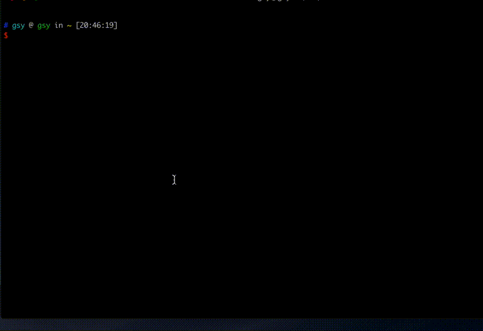

<p align="right" ><a href="./README.md">English</a>|<a href="./README-ZH.md">中文</a></p>

- Now our CI pipline in gitlab is very solw(**every build need more than 10 minutes**) and we need wait the pipline succeed to merge our code to master. **If there are three MR. It need at least 30 minutes to merge them to master**.
- We can use dartanalyzer instead of CI to make sure our code not contains compile error. So we **don't need to awiat ci builder**.
- So we can create a MR after dartanalyzer and **merge it quickly** through `gmr`
- hhhhhhhhhhh

# How to install the gmr

哈哈哈我也改了
1. install gmr. 
   - if you not have wget. you need excute `brew install wget` first
   - if you not have jq. you need excute `brew install jq` first
```bash
wget https://github.com/gsy13213009/shell/archive/v1.0.0.tar.gz \
&& tar -zxvf v1.0.0.tar.gz \
&& rm v1.0.0.tar.gz \
&& cp shell-1.0.0/gmr /usr/local/bin \
&& rm -rf shell-1.0.0
```
2. set gitlab token
   - you can get token form gitlab: Settings>Access Token>Add a personal access token
   - `gmr --set-token="your token"`
3. set gitlab project id(default value is 341)
   - you can get project id for gitlab project home page
   - `gmr --set-pid=111`
4. set gitlab user id(**The merge request will assignee to him**), general your id
   - you can get user id from gitlab: Settings>Profile>Main settings
   - `gmr --set-uid=111`
5. set dartanalyzer path
   - you can get it in flutter path
   - `gmr --set-dartanalyzer=/Users/gsy/flutter/bin/cache/dart-sdk/bin/dartanalyzer`
6. gif of install
   - set host first: `gmr host="https://xxxxx.com"`
   
  
   
# Now you can use gmr to create MR
- only use `gmr` and input mr title after dartanalyzer complete.
- use `gmr -t "(CHORE) create a mr use script" -b guosiyi/master_inbox -l "engineering,CHERRY-PICK,task"` create a MR
- use `gmr -t "(CHORE) create a mr use script"` create a MR. Some params will use default value.
- the detail please check in `gmr -h` 

## The request and response
### request
- when you excute `gmr -p 3114`. It will out put this:
```
flutter format check start
format check succeed
dartanalyzer check start
Analyzing xxxxxxxxxxxx...
No issues found!
Do you agree with use the default merge request title?: (FIX) fix the error of Error from the analysis server: Analysis failed
You can input 'n' to disagree it:
Current branch is master. Please input merge request source branch:test/master
merge project id = 3114 
merge title = (FIX) fix the error of Error from the analysis server: Analysis failed 
merge branch = test/master 
merge labels = engineering 
squash = true 
request data: {
                "id":3114,
                "target_branch":"master",
                "source_branch":"test/master",
                "title":"(FIX) fix the error of Error from the analysis server: Analysis failed",
                "assignee_id":1569,
                "labels":"engineering,script",
                "remove_source_branch":true,
                "squash":true
              }

  % Total    % Received % Xferd  Average Speed   Time    Time     Time  Current
                                 Dload  Upload   Total   Spent    Left  Speed
100  2420  100  2028  100   392   1107    214  0:00:01  0:00:01 --:--:--  1284
You can click it to view the MR:"https://xxxxxxxxxxxxxxxxxxxxxxx/merge_requests/45"
```
- gmr must excute in project path. It will use current branch in param of `source_branch`. And if it is "master", will need you input the source branch

### response
- wait a moment. It will output the mr's info 
- now you can ask someone to review your code and merge it to master

## help of gmr
```
NAME
   gmr -- dartanalyzer projct and create a merge request after that

DESCRIPTION
   -t|--title|--title=
        set merge request title. If not this option.'${BLUE_COLOR_START}' You can input title at last '${BLUE_COLOR_END}'
        or it will get the first commit content of current branch with origin/master branch, you can use it.
   -b|--branch|--branch=
        branch of need merge to master.'${BLUE_COLOR_START}' Default current branch '${BLUE_COLOR_END}'
   -l|--lables|--lables=
        Labels for MR as a comma-separated list.'${BLUE_COLOR_START}' Default"engineering" '${BLUE_COLOR_END}'
   -s|--squash
        false of squash.'${BLUE_COLOR_START}' Default is true '${BLUE_COLOR_END}'
   -p|--pid[=]|--set-pid[=]
        set the project id of current MR | set default gitlab project id. '$BLUE_COLOR_START'Default is 341 food_mex_moblie'$BLUE_COLOR_END'
   -u|--uid[=]|--set-uid[=]
        set assignee user of current MR | set default gitlab user id. The mr will Assignee to him default
   --token[=]|--set-token[=]
        set and show gitlab token. If the input value is empty. Will only show current token
   --dartanalyzer[=]|--set-dartanalyzer[=]
        set and show dartanalyzer path. If the input value is empty. Will only show current dartanalyzer path
   --host[=]|--set-host[=]
        set and show gitlab host. If the input value is empty. Will only show current gitlab host
   -h|--help
        show help
EXAMPLE
   a full command: gmr -t "(CHORE) create a mr use script" -b guosiyi/master_inbox -l "engineering,CHERRY-PICK,task"
   a simple command: gmr -t "(CHORE) create a mr use script"
   or only gmr and use the default title or input title after dartanalyzer complete
```
